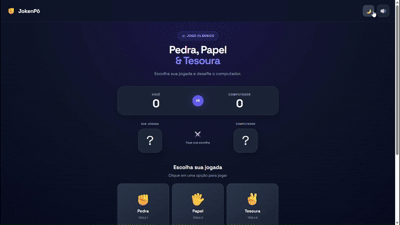

<h1>✊ JokenPô</h1>
 
<h2>💻 HTML | CSS | JavaScript</h2>

Jogo clássico de <b>Pedra</b>, <b>Papel</b> e <b>Tesoura</b> contra o computador, feito com HTML, 
CSS e JavaScript puro, sem bibliotecas ou frameworks. 🕹️

Prévia do jogo

  

 
<h2>🕹️ Como jogar</h2>

É <b>melhor de 5</b>: o primeiro a chegar a 3 vitórias ganha o jogo.

<h2>✨ Funcionalidades</h2>
<ul>
  <li>Placar de você contra o computador</li>
  <li>Suspense antes de revelar a jogada do computador</li>
  <li>Modo melhor de 5, com tela de fim de jogo</li>
  <li>Sequência de vitórias e total de rodadas</li>
  <li>Tema claro e escuro</li>
  <li>Efeitos sonoros gerados pelo navegador (Web Audio API), com botão para silenciar</li>
  <li>Atalhos de teclado: <b>1</b> Pedra, <b>2</b> Papel, <b>3</b> Tesoura</li>
  <li>Preferências de tema e som salvas no navegador</li>
  <li>Layout responsivo, pensado primeiro para celular</li>
  <li>Respeita a configuração de "reduzir movimento" do sistema</li>
</ul>
<h2>🛠️ Tecnologias utilizadas</h2>
<ul>
  <li>HTML5 - Estrutura da página e semântica das seções</li>
  <li>CSS3 - Estilo visual, variáveis de cor, grid, flexbox e os dois temas (claro/escuro)</li>
  <li>JavaScript (ES6+) - Toda a lógica do jogo: regras, placar, suspense, som e preferências</li>
  <li>Web Audio API - Gera os efeitos sonoros direto no navegador, sem arquivos de áudio</li>
  <li>localStorage - Salva a preferência de tema e som do usuário</li>
</ul>
<h2>📚 O que pratiquei neste projeto</h2>
<ul>
  <li>Manipulação do DOM sem frameworks</li>
  <li>Gerenciamento de estado simples com um objeto JS</li>
  <li>Geração de som com a Web Audio API</li>
  <li>Persistência de preferências com localStorage</li>
  <li>Acessibilidade (aria-label, aria-live, prefers-reduced-motion)</li>
  <li>Responsividade mobile-first</li>
</ul>
<h2>🚀 Melhorias futuras</h2>
<ul>
  <li>Salvar o recorde de sequência de vitórias</li>
  <li>Modo multiplayer local (2 jogadores no mesmo dispositivo)</li>
  <li>Animações de transição entre rodadas</li>
</ul>
<h2>👤 Autor</h2>

Desenvolvido por <strong>Raí Salazar</strong>

  

